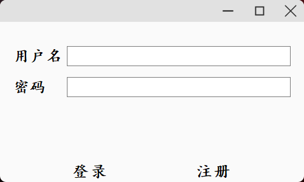
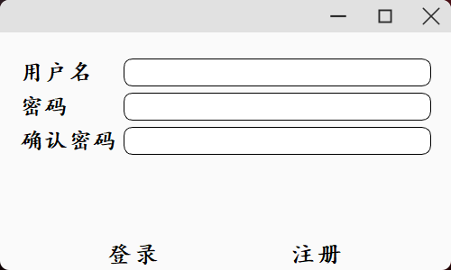
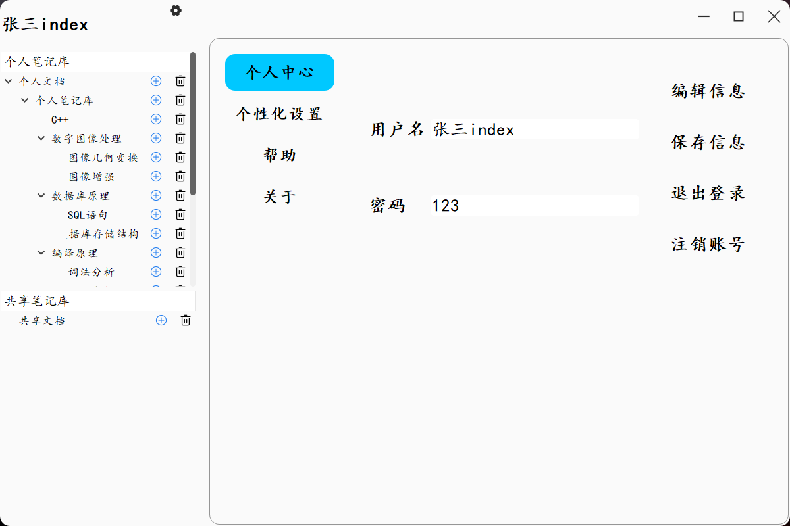
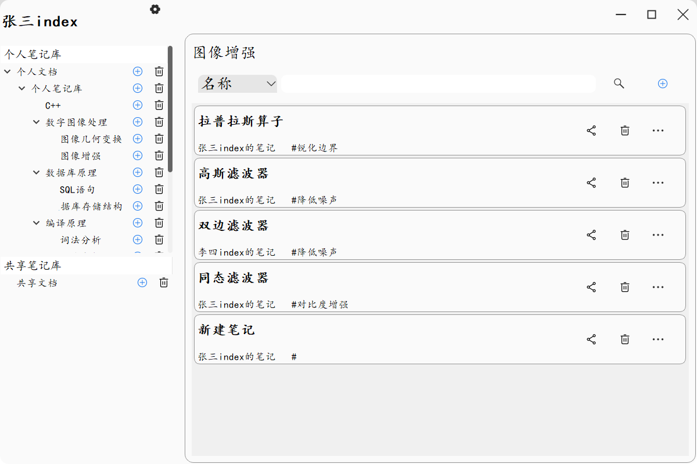
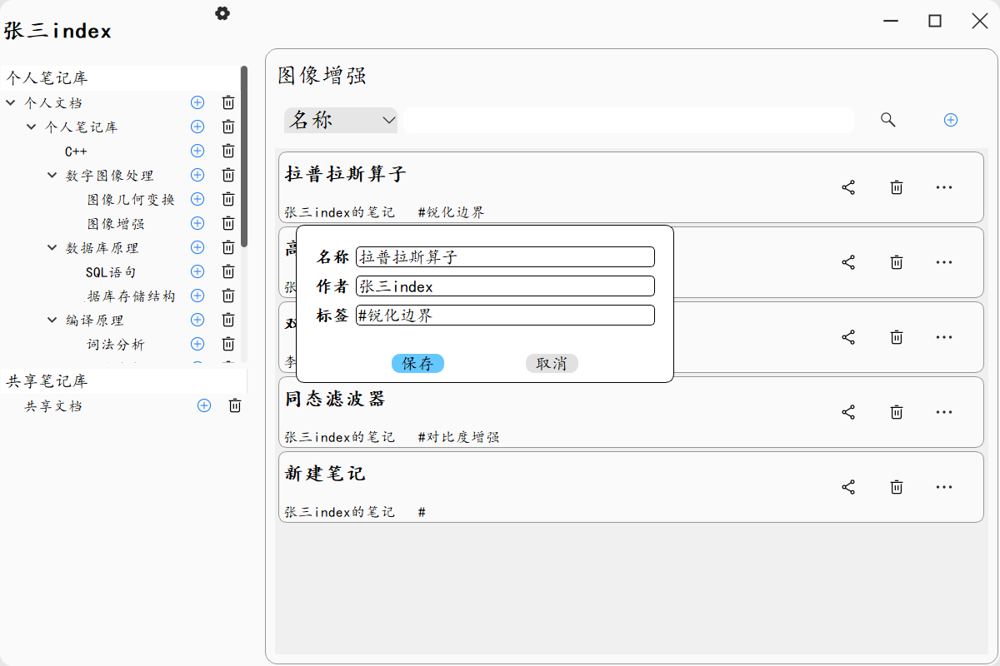
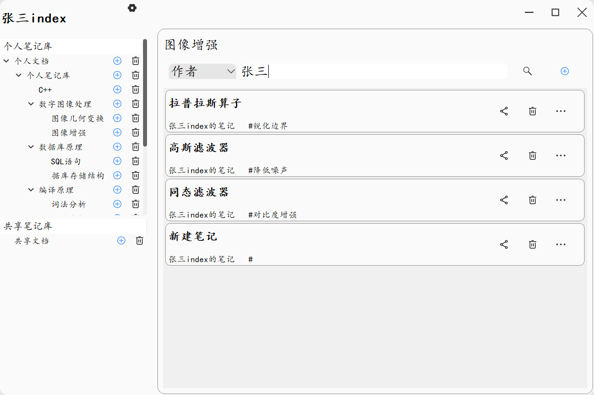
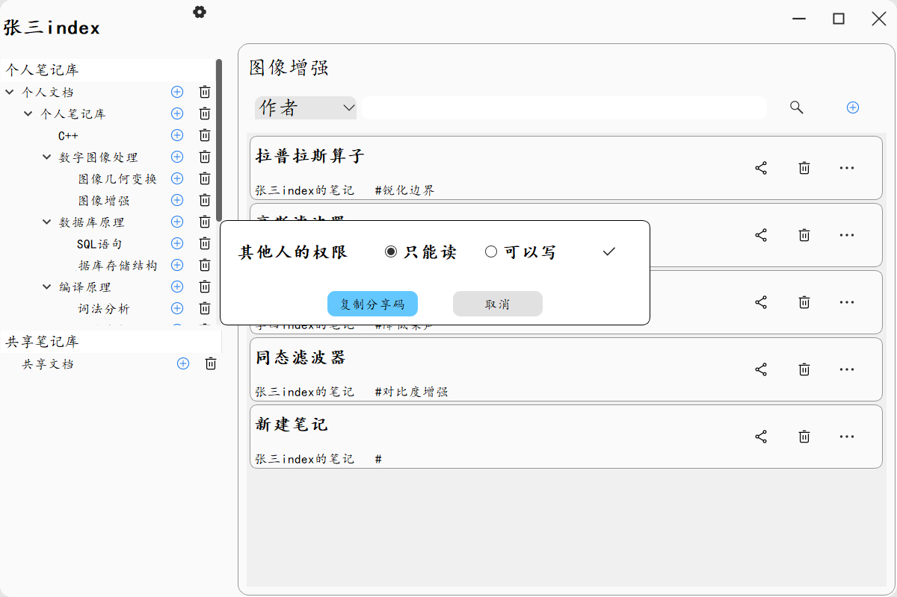
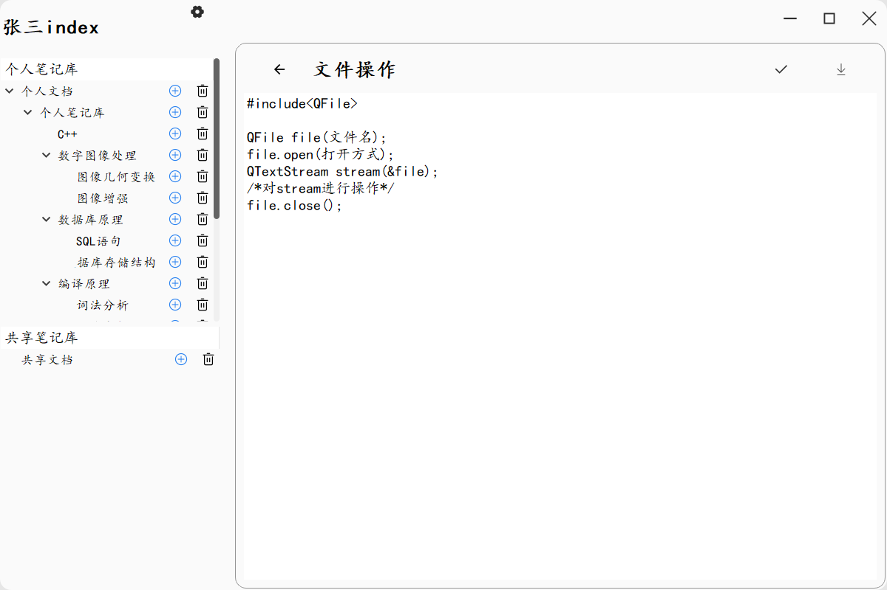
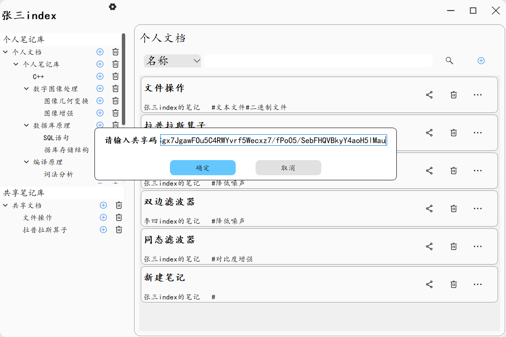

# 云笔记

## 一、介绍

大多数情况下，直接使用文本文件（txt文件）做笔记，并保存在本地PC机上，这种本地笔记存在以下的缺点：一是数据容易丢失，当本地PC机的磁盘发生损坏时，由于一般不存在数据备份，大量的数据可能直接丢失；二是不方便管理，在本地PC机上可以建立文件夹实现笔记的分类管理，但是当存在大量笔记时，使用笔记的标题，标签，内容等特征查询特定笔记并不方便；三是不方便共享，本地写好的笔记，无法直接共享给其他人进行修改。由于本地笔记存在以上的缺点，因此本实验计划开发一个数据保存在公共服务器上的“云笔记”系统，试图克服本地笔记的上述缺点。

## 二、运行截图

1.登录界面

2.注册界面

3.个人中心

4.所有笔记

5.修改笔记特征

6.查询笔记

7.更改权限

8.编辑笔记

9.创建共享笔记

